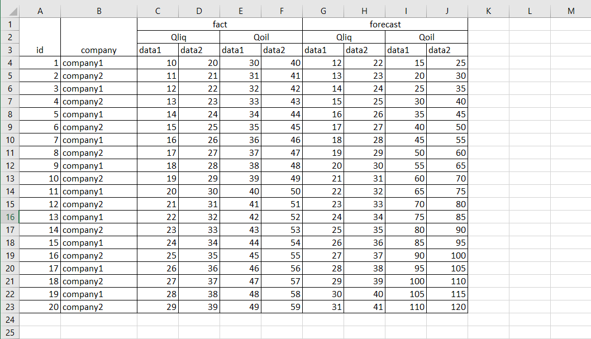

# Excel_parser
Согласно ТЗ был разработан парсер Excel файла.



Парсер поддерживает расширение записей вниз согласно данного макета. А также предусмотрено расширение колонок по горизонтали.

## Описание запуска
- **Выполнить установку пакета:**</br>

Для linux:</br>
```pip install "fact_forecast_parser-0.0.1.tar.gz"```</br>

Для windows:</br>
```pip install "fact_forecast_parser-0.0.1-py3-none-any.whl"```</br>

- **Импортировать файл в ваш проект (в файле main.py):**</br>

```from fact_forecast_parser.parser import FactForecastParser```</br>

- **Создать экземпляр класса парсера:**

```parser = FactForecastParser(input_data='path/to/file/file_excel.xlsx', output_data='path/to/file/database.db')```

*input_data* - указать путь к файлу excel</br>
*output_data* - указать путь к базе данных для сохранения результата

- **Вызвать метод парсинга:**</br>

```parser.parse()``` - *данный метод спарсит файл excel и запишет все данные в БД*</br>

- Расчетный тотал по Qoil, Qliq, сгруппированный по датам для всех таблиц будет отображен при вызове функции: </br>

```parser.get_total()```</br>


</br>

## Дополнительные возможности
Для расширения по горизонтали (либо изменении кол-ва столбцов с данными) необходимо при создании экземпляра парсера (FactForecastParser), передать дополнительный параметр **set_data** (массив объектов) в котором необходимо передать **table_name, col_num_data1, col_num_data2**:</br>

**table_name** - имя столбца (имя таблицы в БД) например (fact_Qliq, forecast_Qoil, more_Qoil, и т.д.)</br>

**col_num_data1** - порядковый номер столбца в файле excel (для столбца "data1" в БД)</br>
**col_num_data2** - порядковый номер столбца в файле excel (для столбца "data2" в БД)</br>

</br>

**Значения по умолчанию:**

```set_data = [{"table_name": "fact_Qliq", "col_num_data1": 3, "col_num_data2": 4},     {"table_name": "fact_Qoil", "col_num_data1": 5, "col_num_data2": 6}, {"table_name": "forecast_Qliq", "col_num_data1": 7, "col_num_data2": 8}, {"table_name": "forecast_Qoil", "col_num_data1": 9, "col_num_data2": 10}]```

Для расширения по горизонтали необходимо передать данное значение как значение по умолчанию + добавить свои словари в данный массив.


</br>
</br>

## Техническое задание:
Создать парсер excel файла (file_excel.xlsx) на Python.

Создать таблицу согласно нормам реляционных баз данных (внести все значения в одну таблицу)

Добавить расчетный тотал по Qoil, Qliq, сгруппированный по датам (даты можете указать свои, добавив программно, не изменяя исходный файл, при условии, что дни будут разные, а месяц и год одинаковые)

1. Результат должен представлять готовое к использованию решение
2. Результат для проверки разместить на Github, предоставить ссылку
3. Просьба показать понимание принципов SOLID и  практик связанных с этими принципами
4. В качестве БД можете использовать любую, например SQLite
